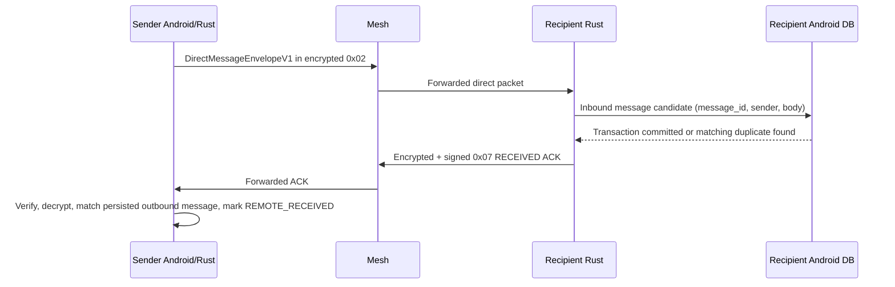

# Gate 1 Protocol Specification: Persistent Message IDs and Signed Acknowledgements

**Status:** Proposed implementation specification  
**Protocol scope:** Direct text messages only  
**Wire compatibility:** Additive extension to Mesh Packet Version `0x03`  
**Prepared for:** RezvanMesh Gate 1 implementation review  
**Author:** Manus AI

> **Normative language.** The terms **MUST**, **MUST NOT**, **REQUIRED**, **SHOULD**, **SHOULD NOT**, and **MAY** are to be interpreted as normative requirements. This document deliberately distinguishes authenticated recipient acknowledgement from radio transmission, routing, or user read state.

## 1. Purpose and Safety Boundary

Gate 1 introduces a stable, end-to-end **message identifier** and one authenticated acknowledgement outcome for direct messages: `RECEIVED`. It corrects the present ambiguity in which the Android application can establish only that the local transport accepted work for queuing. The current direct-message packet is an Olm AEAD ciphertext under packet type `0x02`; it has no application message ID and no receiver-to-sender acknowledgement path. [1] [2]

The new `RECEIVED` state means only the following:

> The intended recipient authenticated and decrypted a syntactically valid direct-message envelope, committed the message ID and content to local durable storage, and sent an acknowledgement that the original sender can authenticate.

It **does not** mean that the recipient read, understood, displayed, forwarded, or acted on the message. It is not a link-layer write confirmation, a GATT callback, or an inference from elapsed time.

| Gate 1 includes | Gate 1 explicitly excludes |
|---|---|
| Persistent 128-bit direct-message IDs | Read receipts |
| Encrypted, Ed25519-signed direct-message acknowledgements | Channel-message acknowledgements |
| Duplicate suppression by `(sender_node_id, message_id)` | Broadcast or emergency delivery receipts |
| Explicit local and remote-received UI states | Voice/PTT protocol activation |
| Capability advertisement and legacy fallback | Automatic retry scheduling policy |

Channel messages remain local-queue-only during Gate 1. A group acknowledgement would create acknowledgement amplification and needs its own product and protocol design.

## 2. Current Protocol Constraints

The existing mesh header has a 34-byte, versioned format containing packet type, originator, destination, sequence, TTL, hop count, next hop, and payload length. It supports signed packet forwarding, but direct packet type `0x02` relies on Olm AEAD rather than an appended Ed25519 signature. [1] [2]

The existing key-announcement bundle carries the peer’s Ed25519 public identity and is already validated against the announced Node ID before it is registered. [2] [3] Gate 1 uses this existing identity binding for acknowledgement signatures. It does not introduce a second long-term identity system.

The current Android database assigns a UUID primary key to a message record but does not place that UUID in the wire payload. Its `SENT`, `DELIVERED`, and `READ` constants are reserved for future protocol evidence; the active implementation uses only truthful local `QUEUED` or `FAILED` outcomes. [4]

| Existing element | Gate 1 consequence |
|---|---|
| `MeshPacketHeader.sequence` is a routing/loop-control value. | It MUST NOT be used as a persistent application message ID. A retry can generate a new packet sequence for the same logical message. |
| Direct payload is Olm AEAD ciphertext. | The message-ID envelope MUST be inside the ciphertext so relays cannot correlate messages by ID. |
| Signed packet types append a 64-byte Ed25519 signature. | The ACK packet MUST use the existing header-plus-payload signing convention. |
| Key bundles accept at least 164 bytes and ignore trailing bytes today. | A trailing capability extension is backward-compatible with current bundle parsing. [3] |

## 3. Protocol Identifiers and Constants

The following values are reserved for Gate 1.

| Symbol | Value | Meaning |
|---|---:|---|
| `MESH_PACKET_VERSION` | `0x03` | Existing mesh header version; unchanged by Gate 1. |
| `PACKET_TYPE_DIRECT_MESSAGE` | `0x02` | Existing encrypted direct-message packet type. |
| `PACKET_TYPE_MESSAGE_ACK` | `0x07` | New encrypted and signed direct-message acknowledgement packet type. |
| `DIRECT_ENVELOPE_MAGIC` | `0x52 0x4D` (`"RM"`) | Prevents legacy plaintext from being interpreted as a Gate 1 envelope. |
| `DIRECT_ENVELOPE_VERSION` | `0x01` | First version of the encrypted direct-message envelope. |
| `ACK_ENVELOPE_MAGIC` | `0x52 0x41` (`"RA"`) | Identifies the encrypted acknowledgement payload. |
| `ACK_ENVELOPE_VERSION` | `0x01` | First version of the acknowledgement payload. |
| `ACK_CODE_RECEIVED` | `0x01` | Recipient durably persisted the authenticated message. |
| `CAPABILITY_FORMAT_VERSION` | `0x01` | Version of the optional key-bundle capability extension. |
| `CAP_MESSAGE_ID_AND_ACK` | bit `0` | Peer supports Gate 1 direct-message envelopes and signed `RECEIVED` ACKs. |

Packet type `0x07` MUST be treated as a **signed, unicast relay candidate**. It MUST be added to the existing signed-type validation set and to the relay-candidate set. Since an ACK’s outer signature covers its header, relays MUST forward it byte-for-byte, using the existing `(originator, sequence)` loop-prevention behavior rather than changing TTL or hop count. [2]

## 4. Message Identity

### 4.1 Identifier generation

The Android sender MUST create a fresh 128-bit uniformly random `message_id` before persisting or transmitting a new direct message. A standard UUID v4 is acceptable only when converted to its canonical 16 raw bytes; the string form is a storage/display representation, not the wire format.

The message ID is immutable for the logical message’s entire lifetime. Manual or later automatic retries MUST retain the same message ID but MAY create a new Olm ciphertext, header sequence, route, and next hop.

The following values MUST NOT be used as a message ID:

| Prohibited source | Reason |
|---|---|
| `MeshPacketHeader.sequence` | It changes on retransmission and is scoped to routing. |
| Device timestamp | It is predictable and can collide across devices. |
| Database row position | It is local-only and may be reused after migration or restore. |
| Content hash | It leaks equality of message contents and fails for intentional duplicates. |

### 4.2 Direct-message envelope

Before Olm encryption, a Gate 1-capable sender constructs `DirectMessageEnvelopeV1` in the following canonical big-endian format.

| Offset | Size | Field | Rules |
|---:|---:|---|---|
| 0 | 2 | `magic` | MUST equal `0x52 0x4D`. |
| 2 | 1 | `envelope_version` | MUST equal `0x01`. |
| 3 | 1 | `message_kind` | `0x00` for text in Gate 1. Other values are reserved and MUST be rejected. |
| 4 | 16 | `message_id` | Sender-generated random identifier. MUST NOT be all zeroes. |
| 20 | 8 | `created_at_ms` | Unsigned Unix epoch milliseconds for display/audit only; MUST NOT be used as the sole security decision input. |
| 28 | 4 | `body_len` | Unsigned big-endian byte count. MUST equal the remaining bytes exactly. |
| 32 | `body_len` | `body` | UTF-8 text bytes for `message_kind = 0x00`; invalid UTF-8 MUST be rejected for Gate 1 text. |

The resulting plaintext is passed to the existing pairwise session encryption path and then placed in the payload of packet type `0x02`. The outer direct-message header remains as it is today: `originator` is the sender, `destination` is the intended recipient, and `next_hop` is the routing-selected hop. [2]

### 4.3 Legacy direct messages

If the decrypted direct-message plaintext does not begin with `DIRECT_ENVELOPE_MAGIC`, the receiver MUST treat it as a legacy message. It MAY display the legacy message according to current behavior, but it MUST NOT generate a Gate 1 acknowledgement, invent a synthetic message ID, or display remote delivery evidence.

A Gate 1-capable sender MUST send `DirectMessageEnvelopeV1` only after capability negotiation indicates that the recipient supports `CAP_MESSAGE_ID_AND_ACK`. Otherwise, it MUST use the current legacy direct-message plaintext path and retain local-only status.

## 5. Capability Advertisement and Negotiation

### 5.1 Key-bundle extension

The present key bundle is 164 bytes: Olm identity, one-time key, X25519 identity, Ed25519 identity, epoch number, and epoch key. [3] Gate 1 appends the following optional 5-byte extension to the payload of signed packet type `0x05`.

| Offset from bundle start | Size | Field | Rules |
|---:|---:|---|---|
| 164 | 1 | `capability_format_version` | `0x01` for this extension. |
| 165 | 4 | `capability_bits` | Unsigned big-endian bit set; bit 0 is `CAP_MESSAGE_ID_AND_ACK`. |

A new implementation MUST accept an incoming bundle of exactly 164 bytes as a legacy bundle with zero capabilities. It MUST ignore an unknown capability-format version and treat the peer as having zero optional capabilities. Existing implementations already accept a bundle of at least 164 bytes, so they safely retain their current behavior when seeing the extension. [3]

### 5.2 Sending rule

A direct-message sender MUST use this decision table.

| Recipient state | Payload to send | Highest truthful sender state |
|---|---|---|
| Known peer, Gate 1 capability present | `DirectMessageEnvelopeV1` inside packet type `0x02` | `LOCAL_TRANSPORT_ACCEPTED`, later `REMOTE_RECEIVED` only after a valid ACK. |
| Known peer, no Gate 1 capability | Legacy plaintext inside packet type `0x02` | `LOCAL_TRANSPORT_ACCEPTED`; never `REMOTE_RECEIVED`. |
| Unknown key bundle or no secure session | Do not construct a direct message. Surface a local failure. | `FAILED_LOCAL`. |

A capability bit is an interoperability signal, not proof of trust. The existing key-announcement Node-ID-to-Ed25519-key binding and signature verification remain mandatory before a peer is considered eligible for a signed ACK. [2]

## 6. Signed Acknowledgement Packet

### 6.1 Overview

The receiver sends one `PACKET_TYPE_MESSAGE_ACK` (`0x07`) packet after Android durable persistence succeeds. It is both **encrypted** using the existing pairwise session and **signed** with the receiver’s Ed25519 identity.

Encryption prevents relays from learning the message ID or acknowledgement outcome. The outer signature authenticates the ACK originator before the sender spends work attempting decryption. Signing covers the header and ciphertext together, following the existing signed-packet convention. [1] [2]

### 6.2 ACK plaintext envelope

Before pairwise encryption, the recipient constructs `MessageAckEnvelopeV1`.

| Offset | Size | Field | Rules |
|---:|---:|---|---|
| 0 | 2 | `magic` | MUST equal `0x52 0x41`. |
| 2 | 1 | `ack_version` | MUST equal `0x01`. |
| 3 | 1 | `ack_code` | Gate 1 permits only `0x01` (`RECEIVED`). |
| 4 | 16 | `message_id` | Must equal the persisted Gate 1 direct-message ID. |
| 20 | 8 | `original_sender` | Must equal the original direct-message header `originator`. |
| 28 | 8 | `original_recipient` | Must equal the ACK header `originator` and the local node. |
| 36 | 8 | `ack_created_at_ms` | Display/audit metadata only; not a trusted clock assertion. |

The length of `MessageAckEnvelopeV1` is exactly 44 bytes. Any other length MUST be rejected.

### 6.3 Outer wire packet

The encrypted ACK ciphertext becomes the packet payload. The resulting outer packet is:

```text
[MeshPacketHeader, 34 bytes]
[Olm-encrypted MessageAckEnvelopeV1, payload_len bytes]
[Ed25519 signature over header || encrypted payload, 64 bytes]
```

| Header field | Required ACK value |
|---|---|
| `version` | Current `MESH_PACKET_VERSION` (`0x03`). |
| `packet_type` | `0x07`. |
| `originator` | Recipient of the original direct message; the ACK signer. |
| `destination` | Original direct-message sender. |
| `next_hop` | Best currently known route to `destination`, or `destination` when directly adjacent. |
| `ttl` | `10` initially; relays MUST NOT mutate it because the header is signed. |
| `sequence` | Fresh originator packet sequence; MUST NOT reuse the original message sequence. |
| `hop_count` | `0` initially; relays MUST NOT mutate it. |
| `payload_len` | Exact encrypted-payload length. |

### 6.4 ACK emission point

The Rust engine MUST NOT emit the ACK immediately after decryption. At that point it has not established that Android has stored the inbound message.

The required sequence is:



The Android receiver MUST insert the inbound message using a transaction that enforces a unique constraint on `(sender_node_id, protocol_message_id)`. It MUST call a new native `nativeBuildMessageReceivedAck` API only after that transaction commits or confirms that the same valid inbound message already exists. The latter rule lets a receiver resend an ACK after the sender retransmits because a prior ACK was lost.

### 6.5 Native API additions

The current JNI direct-send method accepts recipient ID, plaintext, and type, but no application message ID. [5] Gate 1 replaces or supplements it with explicit envelope-oriented APIs.

| API | Inputs | Required outcome |
|---|---|---|
| `nativeSendDirectMessageV1` | `recipient_node_id[8]`, `message_id[16]`, `created_at_ms`, `message_kind`, `body` | Produces packet type `0x02` actions using the Gate 1 envelope. |
| `nativeProcessIncoming` extension | Existing raw packet, RSSI, timestamp | Emits an inbound candidate containing `message_id`, sender, recipient, kind, and body after successful decryption/envelope parsing. |
| `nativeBuildMessageReceivedAck` | `original_sender[8]`, `message_id[16]`, `ack_created_at_ms` | Produces signed packet type `0x07` actions only when the engine can encrypt to the sender. |
| `nativeProcessIncoming` ACK extension | Existing raw packet, RSSI, timestamp | Emits `MessageAcknowledged` only after full signature, destination, decryption, and binding checks. |

The acknowledgement API MUST return an explicit local error when no usable session or route exists. Android may persist an `ack_pending` record and retry sending the ACK later, but it MUST NOT claim that the ACK was sent until a local transport acceptance result exists.

## 7. Receive Validation and Anti-Replay Rules

### 7.1 Direct-message receive processing

A recipient processing a `0x02` direct message MUST apply the following order.

| Step | Requirement | Failure result |
|---:|---|---|
| 1 | Verify mesh packet version, destination, and normal direct routing rules. | Drop. |
| 2 | Decrypt with the session for `header.originator`. | Drop without ACK. |
| 3 | If legacy plaintext, follow legacy rendering path; do not ACK. | Local-only legacy handling. |
| 4 | Validate magic, version, kind, exact body length, nonzero 16-byte ID, and UTF-8 body. | Drop without ACK. |
| 5 | Hand the valid candidate to Android persistence. | No ACK until persistence result returns. |
| 6 | Insert once by `(sender_node_id, protocol_message_id)`. | Persist or identify a matching existing record. |
| 7 | Request a `RECEIVED` ACK after durable insert or valid duplicate match. | ACK may remain pending if no route/session. |

A duplicate `message_id` from the same sender MUST NOT create a second visible message. A duplicate from a different sender is a distinct record and MUST NOT be conflated.

### 7.2 ACK receive processing

An original sender processing packet type `0x07` MUST apply the following checks in order.

| Step | Requirement | Failure result |
|---:|---|---|
| 1 | Header version must be `0x03`, packet type must be `0x07`, and destination must equal the local node ID. | Drop. |
| 2 | Require exactly one appended 64-byte signature after the payload. | Drop. |
| 3 | Resolve the originator’s previously validated Ed25519 key from a KeyAnnouncement and verify the outer signature over `header || ciphertext`. | Drop. |
| 4 | Apply existing relay/sequence replay filtering for this signed unicast packet. | Drop duplicate relays. |
| 5 | Decrypt the ciphertext using the session for `header.originator`. | Drop. |
| 6 | Require a 44-byte `MessageAckEnvelopeV1`, supported version, and `ACK_CODE_RECEIVED`. | Drop. |
| 7 | Require `original_sender == local_node_id`, `original_recipient == header.originator`, and a matching locally persisted outbound direct message addressed to `header.originator`. | Drop and log a privacy-preserving diagnostic. |
| 8 | Perform an idempotent state transition to `REMOTE_RECEIVED`. | Notify UI at most once. |

The sender MUST NOT accept an ACK merely because it is signed by a known peer. The tuple `(message_id, original_sender, original_recipient, header.originator, header.destination)` MUST bind to a locally originated direct message. This prevents a valid ACK from one context being replayed to upgrade a different conversation.

### 7.3 ACK rate limiting

To prevent retransmissions from producing unnecessary traffic, Android MUST maintain an `ack_outbox` record keyed by `(original_sender, message_id, ack_code)`. It SHOULD send at most one ACK per matching incoming message in a configurable short interval, while allowing a later ACK retry if the outbox remains unaccepted or if the direct message is received again after the interval.

The sender’s `REMOTE_RECEIVED` update is idempotent. Replayed, duplicated, or delayed valid ACKs MUST NOT create repeated notifications, change content, or downgrade any later state.

## 8. Persistence and State Model

### 8.1 Android database migration

The existing `messages.id` UUID field MAY remain the local primary key, but Gate 1 requires a separate fixed-width protocol identity field. [4]

| Table | Required additions | Constraint/purpose |
|---|---|---|
| `messages` | `protocol_message_id BLOB NULL`, `protocol_version INTEGER NULL`, `recipient_node_id TEXT NULL`, `local_created_at_ms INTEGER NULL` | Persist the 16-byte wire ID and outbound recipient binding. |
| `messages` | `remote_received_at_ms INTEGER NULL`, `remote_ack_sender_id TEXT NULL`, `remote_ack_received_at_ms INTEGER NULL` | Record authenticated receipt evidence and local observation time. |
| `messages` | `attempt_count INTEGER NOT NULL DEFAULT 0`, `last_attempt_at_ms INTEGER NULL`, `expires_at_ms INTEGER NULL` | Reserve durable retry/expiry fields; automatic retry policy is a later gate. |
| `message_ack_outbox` | `original_sender_id TEXT`, `message_id BLOB`, `ack_code INTEGER`, `state`, timestamps | Persist recipient ACK intent until locally accepted or expired. |

The database MUST enforce `UNIQUE(sender_id, protocol_message_id)` for non-null inbound Gate 1 message IDs. For outbound rows, it MUST enforce uniqueness of `protocol_message_id` per local identity. SQLite partial indexes MAY be used so legacy rows with `NULL` remain valid.

### 8.2 Gate 1 sender states

The UI and persistence layer MUST use evidence-based state names. Legacy `SENT`, `DELIVERED`, and `READ` labels MUST NOT be repurposed without migration.

| State | Entry evidence | User-facing meaning |
|---|---|---|
| `QUEUED_LOCAL` | Durable outbound row created before native submission. | Waiting to be submitted locally. |
| `LOCAL_TRANSPORT_ACCEPTED` | The radio/action dispatcher accepted the packet for local processing. | Queued on this device; not proof of transmission or receipt. |
| `FAILED_LOCAL` | Native/session/routing/radio submission rejected the attempt. | This device could not queue the message. |
| `REMOTE_RECEIVED` | Valid signed, encrypted ACK matched the exact outbound message and peer. | Recipient device securely confirmed storage of the message. |
| `EXPIRED` | A later product policy ends retry eligibility without an ACK. | Receipt was not confirmed before the configured expiry. |

`READ` is outside Gate 1. `DELIVERED` SHOULD NOT be shown unless product terminology explicitly defines it as the authenticated `REMOTE_RECEIVED` condition. The recommended label is **Received by recipient device**.

### 8.3 Retry behavior

Gate 1 preserves the current user-triggered retry behavior but changes its identity rule: retries MUST reuse the existing protocol message ID. A future automatic retry scheduler can use the reserved fields, but it must not be introduced without a separate product policy for TTL, battery impact, network load, and acknowledgement outbox handling.

## 9. Rust Implementation Plan

The following work packages keep wire-format ownership in Rust and user-state ownership in Android.

| Work package | Rust changes | Android changes |
|---|---|---|
| Shared wire types | Add `MessageId`, `DirectMessageEnvelopeV1`, `MessageAckEnvelopeV1`, strict serializers/deserializers, and test vectors in `rezvan-common`. | Add 16-byte ID conversion helpers with UUID v4 validation. |
| Capability support | Extend key bundle creation/parsing with the optional 5-byte extension and persistent peer capability map. | Surface capability only to the send coordinator; do not expose it as delivery evidence. |
| Direct send | Add `send_message_v1` that serializes the envelope before existing session encryption. | Generate/persist ID before native call and select V1 only when capability is present. |
| Direct receive | Parse V1 after decryption; emit inbound candidate with message ID but no immediate ACK. | Transactionally upsert inbound message and call ACK builder only after commit. |
| ACK construction | Add a signed-unicast packet builder and encrypted `build_received_ack`. | Persist ACK outbox state and dispatch returned actions. |
| ACK validation | Add type `0x07` signature, routing, decrypt, binding, and idempotence checks; emit `MessageAcknowledged`. | Match against the exact outbound record and transition only to `REMOTE_RECEIVED`. |

The direct-message and ACK envelope serializers MUST reject noncanonical length fields, trailing bytes, unknown required versions, and unsupported kinds/codes. Parsing code MUST avoid panics for hostile radio input.

## 10. Compatibility and Rollout

Gate 1 is additive and does not change `MESH_PACKET_VERSION`. New and legacy nodes can coexist because capability-advertising nodes select the V1 envelope only for capable peers.

| Sender | Recipient | Expected behavior |
|---|---|---|
| Legacy | Legacy | Existing direct-message behavior. |
| Gate 1 | Legacy or capability unknown | Existing legacy direct payload; local-only state. |
| Legacy | Gate 1 | Gate 1 node renders legacy message; no ACK. |
| Gate 1 | Gate 1 with capability | V1 message ID envelope, durable inbound dedupe, signed `RECEIVED` ACK. |

A Gate 1 node that receives packet type `0x07` without a registered sender identity MUST drop it. It MUST NOT learn or replace identity keys from an ACK. Only the existing signed KeyAnnouncement flow is permitted to establish peer identity. [2] [3]

Rollout SHOULD use a feature flag with these phases:

1. Ship parsers, data migration, capability advertisement, and telemetry counters with V1 sending disabled.
2. Enable V1 sending only for two capable test devices.
3. Enable for all capable peers after CI, two-device, duplicate, relay, and downgrade tests pass.
4. Keep legacy fallback until product policy defines a retirement version and migration window.

## 11. Security and Privacy Requirements

| Risk | Required control |
|---|---|
| Forged acknowledgement | Verify the outer Ed25519 signature with the originator’s registered, Node-ID-bound key. |
| ACK replay | Use existing `(originator, sequence)` relay filtering and idempotent message-state updates keyed by the authenticated message ID. |
| Context substitution | Bind sender, recipient, message ID, and ACK originator/destination in the encrypted ACK envelope and validate all of them. |
| Relay metadata disclosure | Encrypt the ACK envelope; relays see only the signed outer header and ciphertext. |
| Duplicate visible messages | Enforce database uniqueness on `(sender_node_id, protocol_message_id)`. |
| ACK-before-persistence false claim | Build an ACK only after the Android database transaction succeeds or validates a matching existing row. |
| ACK storm | Exclude channels/broadcasts, use durable ACK outbox deduplication, and rate-limit retransmission responses. |
| Downgrade confusion | Send V1 only after capability advertisement; legacy messages remain explicitly local-only. |
| Unknown identity | Never accept a signed ACK from a peer lacking a validated KeyAnnouncement identity. |

The Gate 1 implementation MUST log only privacy-preserving diagnostics. Logs MAY include packet type, truncated node ID, message-ID prefix, and failure class. They MUST NOT log plaintext body, complete message ID, key material, ciphertext, or signature bytes at normal diagnostic levels.

## 12. Required Test Plan

### 12.1 Rust unit and property tests

| Test group | Required cases |
|---|---|
| `rezvan-common` envelope serialization | Golden vector round-trip; every field boundary; invalid magic/version/kind/code; zero ID; mismatched/truncated/extra body length; invalid UTF-8 text. |
| Message-ID behavior | Same logical retry retains ID; two equal-body sends use distinct IDs; sender IDs namespace inbound duplicate records. |
| Capability bundle | Legacy 164-byte bundle; V1 169-byte bundle; unknown capability version; unknown bits; malformed short extension. |
| ACK cryptography | Valid sign/encrypt/decrypt/verify path; wrong Ed25519 key; wrong Olm session; modified header; modified ciphertext; modified signature; header originator/key mismatch. |
| ACK binding | Wrong original sender; wrong original recipient; wrong destination; unknown local ID; ACK for a different peer; duplicate ACK idempotence. |
| Relay behavior | Signed `0x07` is forwarded byte-for-byte; loop suppression works; relay never mutates signed ACK header fields. |

### 12.2 Android tests

| Test group | Required cases |
|---|---|
| Room migration | Existing legacy rows migrate with null protocol IDs and unchanged conversation history. |
| Outbound persistence | ID is generated before native send; retry keeps it; failed submission does not generate a replacement ID. |
| Inbound dedupe | Same `(sender, ID)` inserts once; same ID from different sender inserts twice; legacy rows remain supported. |
| ACK sequencing | No ACK before transaction success; an existing matching row permits ACK regeneration; storage failure produces no ACK. |
| State transitions | Only a matched valid ACK produces `REMOTE_RECEIVED`; stale/unknown/wrong-peer ACKs have no user-visible effect. |
| UI semantics | `LOCAL_TRANSPORT_ACCEPTED` never renders as delivered; `REMOTE_RECEIVED` has a distinct accessible label. |

### 12.3 GitHub Actions and real-device gates

GitHub Actions MUST run the Rust test suite, Android JVM tests, resource checks, and a debug APK build for every Gate 1 change. The existing workflow already runs Rust checks and Android JVM/debug validation, and should add focused Gate 1 test suites as they are created. [6]

A release candidate MUST additionally pass a documented two-device matrix outside CI: first contact and key announcement, direct V1 send, ACK receipt, lost ACK plus retry, duplicate message suppression, route change, process restart before/after ACK, no-route failure, legacy peer fallback, and tampered packet rejection. CI cannot establish BLE range, OEM background behavior, or GATT reliability.

## 13. Acceptance Criteria

Gate 1 is complete only when all of the following statements are true.

| ID | Acceptance criterion |
|---|---|
| G1-01 | Every capable direct message has one persistent 16-byte ID shared by Android storage and encrypted wire envelope. |
| G1-02 | A retry reuses the same ID and cannot create a second visible inbound message. |
| G1-03 | A recipient sends `RECEIVED` only after durable storage succeeds or a matching duplicate is confirmed. |
| G1-04 | The sender marks `REMOTE_RECEIVED` only after a signed, encrypted ACK is verified, decrypted, and bound to the exact local outbound message and recipient. |
| G1-05 | Invalid, replayed, unknown-peer, mismatched, or tampered ACKs do not change sender UI state. |
| G1-06 | Legacy peers interoperate with explicit local-only status and no false delivery indicator. |
| G1-07 | Channel and emergency messages do not emit Gate 1 ACKs. |
| G1-08 | Rust unit/property tests, Android persistence/state tests, GitHub Actions, and required two-device cases pass. |

## 14. Implementation Checklist

| Sequence | Deliverable | Owner boundary |
|---:|---|---|
| 1 | Shared `MessageId`, direct envelope, ACK envelope, and golden vectors | Rust `rezvan-common` |
| 2 | Optional capability extension with legacy parsing | Rust session/key-announcement flow |
| 3 | V1 direct-send JNI and Android outbound migration | Rust core + Android data/send coordinator |
| 4 | Inbound candidate action and transactional Android dedupe | Rust core + Android repository |
| 5 | ACK-builder JNI, signed unicast routing, and ACK receiver action | Rust core + radio dispatcher |
| 6 | ACK outbox and exact outbound-record matching | Android data layer |
| 7 | Status/UI migration and accessibility labels | Android UI |
| 8 | CI suites and physical-device evidence | Rust, Android, GitHub Actions, device lab |

## References

[1]: https://github.com/SMozaff/RezvanMesh/blob/80791397b5fcba1e45afd43a3db9dd0b8e517a08/rust/rezvan-common/src/lib.rs "RezvanMesh shared mesh packet and decrypted-message definitions"
[2]: https://github.com/SMozaff/RezvanMesh/blob/80791397b5fcba1e45afd43a3db9dd0b8e517a08/rust/rezvan-core/src/engine.rs "RezvanMesh packet validation, relay, and direct-message engine"
[3]: https://github.com/SMozaff/RezvanMesh/blob/80791397b5fcba1e45afd43a3db9dd0b8e517a08/rust/rezvan-core/src/session.rs "RezvanMesh key-bundle and peer identity session management"
[4]: https://github.com/SMozaff/RezvanMesh/blob/80791397b5fcba1e45afd43a3db9dd0b8e517a08/android/app/src/main/java/com/rezvani/mesh/data/entities/MessageEntity.kt "RezvanMesh Android persisted message model"
[5]: https://github.com/SMozaff/RezvanMesh/blob/80791397b5fcba1e45afd43a3db9dd0b8e517a08/rust/rezvan-core/src/lib.rs "RezvanMesh JNI send and receive bridge"
[6]: https://github.com/SMozaff/RezvanMesh/blob/80791397b5fcba1e45afd43a3db9dd0b8e517a08/.github/workflows/ci.yml "RezvanMesh continuous-integration workflow"
